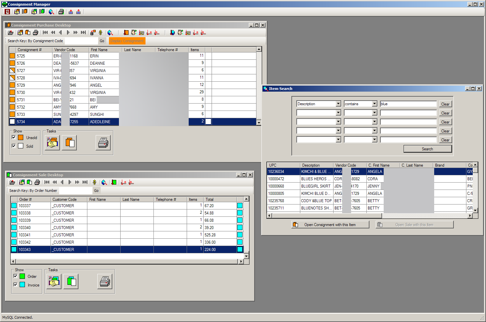
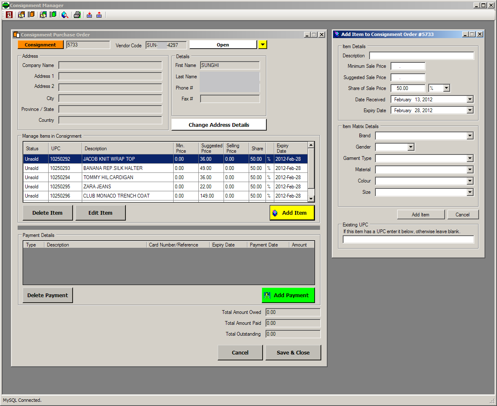
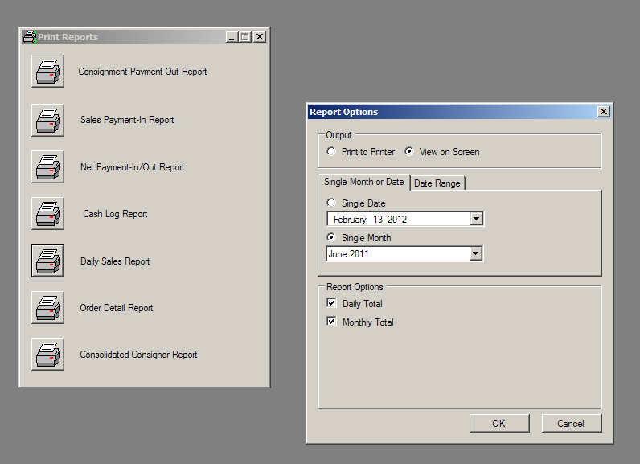
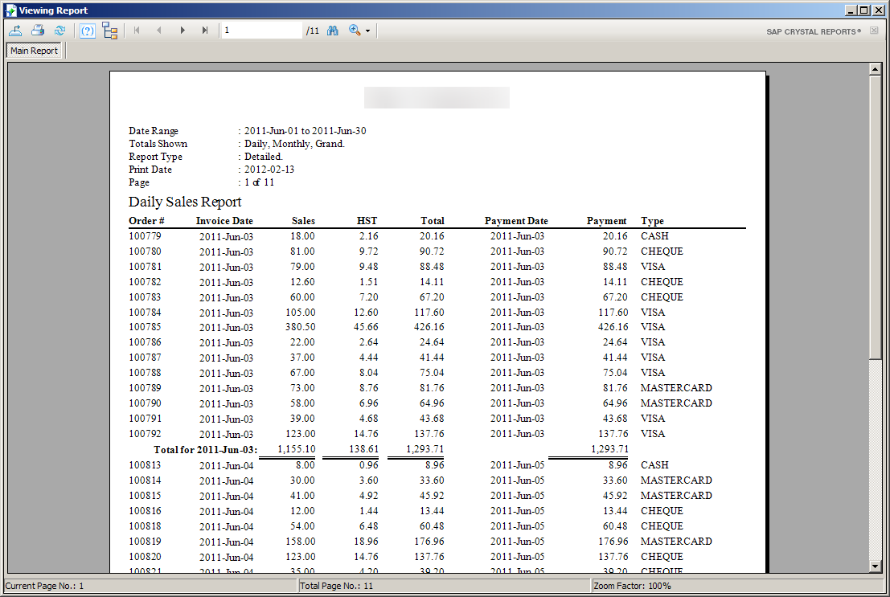

# Consignment Manager

C# WinForms Application. Management program for retail stores that work on a consignment system (% shared on sale).

**Background**

I wrote this Consignment Management program for a Consignment Store located in Vancouver in 2011. I was employed by CompuMAX to develop this system. The CEO, Ken Tung, gave me permission to share the source code of the project publicly on my GitHub under a GPL license. Thank you Ken.

The project took 6-12 months to complete from start to finish. Work began in January 2011, with the first release to the customer in August 2011, followed by updates through to December 2011.

**Concept**

The concept is simple, a vendor provides items to a store to stock on their shelves. Upon the sale, the store pays the vendor a percentage of the revenue.

The program provides inventory and vendor management, consignment intake and sales, consignor payout tracking, and reporting.

**Capabilities**

- **Vendor and customer records** with lookup by customer code, first/last name, or phone.
- **Item-level inventory keyed to UPC/barcodes**, including printable **barcode item labels**.
- **An order status workflow**: open, pending, in progress, invoiced, work completed, cancelled.
- **Payment and payout tracking** to consignors (a payments ledger, net-payment-after-commission calculations, a cash log).
- **A full Crystal Reports suite**: consignment agreement (the contract with the consignor), consignment invoice, sale receipt, daily sales, order detail, net/consolidated consignor payment reports, and a cash log report.
- **Data import/export** for moving the dataset in and out.

**Framework**

The framework is a little unconventional. While it is a Windows desktop application written in C#, MySQL was used for the database, rather than MSSQL, due to my familiarity at the time after working with MySQL in PHP.

**Requirements**

Crystal Reports Runtime is required which includes the required CrystalDecisions.* References - install the appropriate "CRRuntime" msi file for your system.

MySQL Connector .net is required - the original connector 6.3.4 installer is included here - mysql.data.msi

The database structure has to be prepopulated from consignment_db_structure.sql

**Important Notes**

This code is old, and is shared here for historical and informational purposes.

It's requirements and dependancies are old, which likely means the code is insecure and likely contains a number of CVEs. These will be addressed in due time.

Additionally the project is hard-coded for one store and still uses "HST" instead of the "GST/PST" combination for sales taxes as this was in place in BC during 2011 and was dropped in 2013. This will also be addressed in a future update.

Finally there are a number of plain-text MySQL queries in the source code which need to be replaced with LINQ or another safer method.

**Release**

Originally an installer was used that setup the database and installed all dependancies - this is not included in the Git repository.

There will not be a pre-built binary or release at this time until the above issues are addressed and I confirm it is safe to distribute.

**Screenshots**

